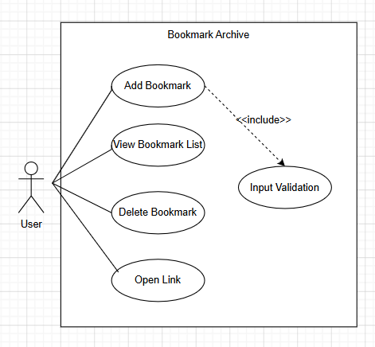
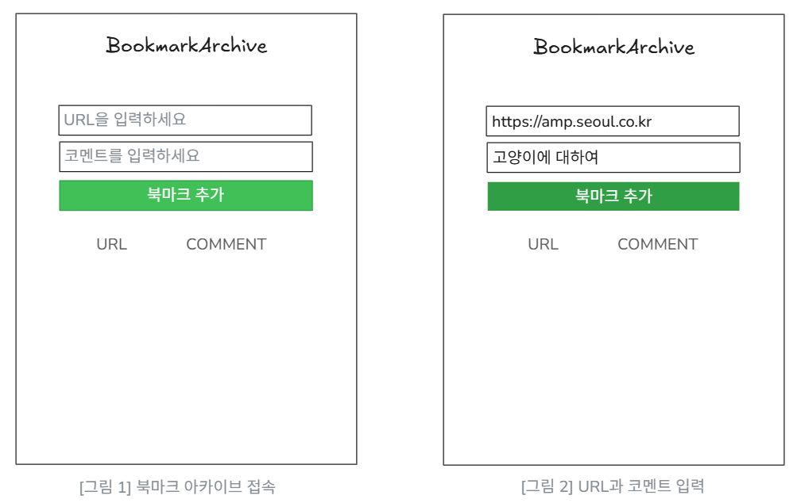
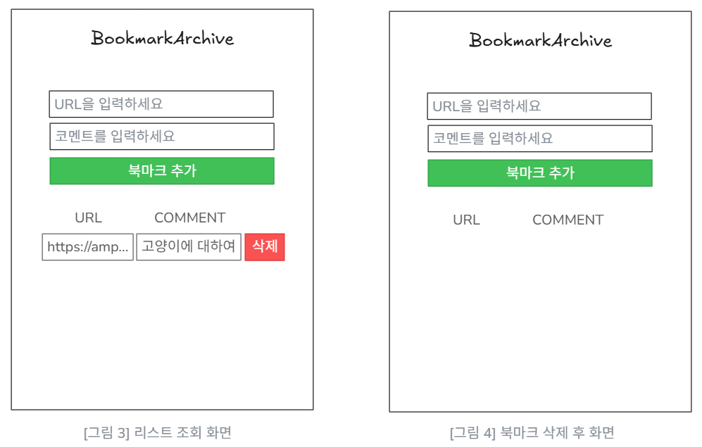
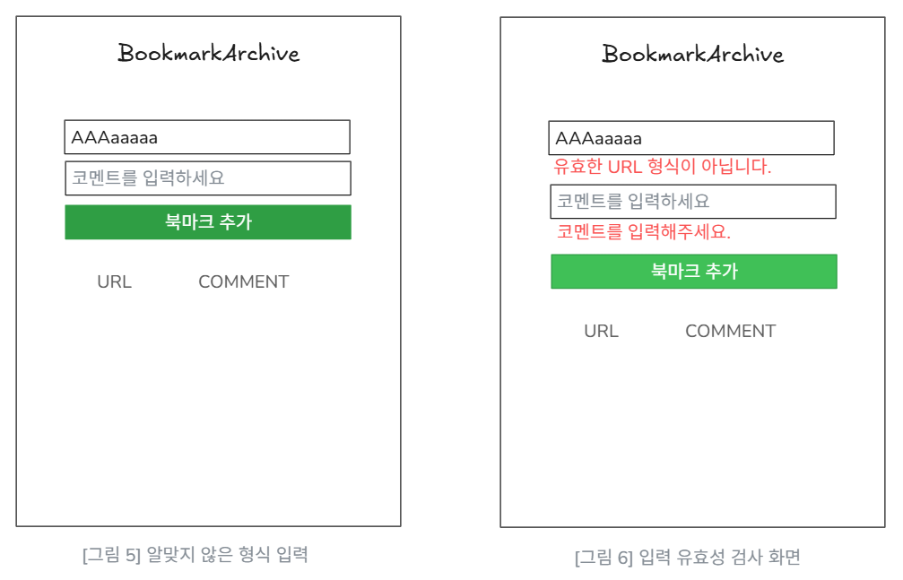
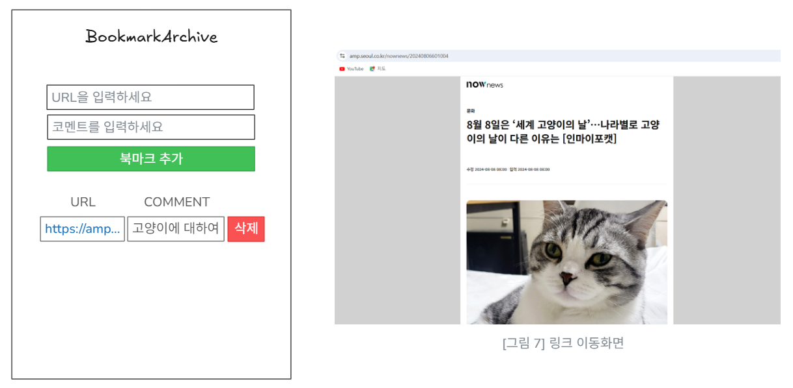

# Bookmark Archive
##### 22412053 이화윤 (lhydgdm@gmail.com)
 

## 1. Introduction
**1. Summary**

어느 사이트에서든 사용자가 다시 조회하고자 하는 정보는 존재하며 그 정보의 양이 방대해지고 있다. 이를 효율적으로 관리하기 위해 만들게 된 웹 서비스가 바로 'Bookmark Archive'이다. 이 서비스는 사용자에게 보다 직관적인 인터페이스를 제공하여 사용자의 정보 접근성을 극대화하고 개인화된 정보 저장 공간을 제공한다.

**2. Features of 'Bookmark Archive'**

Bookmark Archive는 사용자의 인지 부하를 최소화하기 위해 불필요한 부가 기능을 굳이 추가하지 않았다. 학습 과정에서 발생하는 나중에 다시 볼 정보를 빠르게 기록하고, 기록된 정보를 직관적으로 재접근할 수 있도록 설계하여 사용자의 편의성과 사용에 대한 간편성을 제공하는 데 초점을 두었다. 또한, 단순히 URL을 나열하는 방식에서 벗어나 저장하는 시점 당시의 생각이나 핵심 요약을 코멘트로 함꼐 기록하게 함으로써, 시간이 지나 뒤에도 정보의 수집 맥락을 즉각적으로 상기시킬 수 있도록 하였다.
  

----
## 2. Use case Analysis
**1. Use case Diagram**

Conceptualization에서 작성한 use case를 바탕으로 use case diagram을 작성하였다. Actor와 use case간 관계 및 use case들 간의 관계를 표현하였다. 유효성 검사 기능은 사용자가 직접 실행하는게 아니라 북마크 추가 기능을 통해 수행되므로 include 관계를 명시해주었다.
  

**2. Use case description**

|Use case #1 : Add Bookmark| |
|----|----|
|GENERAL CHARACTERSTICS| |
|Summary|사용자가 링크와 코멘트를 입력하면 시스템에 두 정보를 한 쌍으로 저장한다.|
|Scope|북마크 관리 시스템|
|level|User level|
|Status|Analysis|
|Primary Actor|User|
|Precondition|사용자가 시스템에 접속한 상태여야 한다.|
|Trigger|사용자가 '추가' 버튼을 클릭할 때|
|Success Post Condition|입력된 정보가 데이터베이스에 저장되고, 북마크 목록 화면에 새로운 항목이 표시된다.|
|Failed Post Condition|입력된 정보가 저장되지 않으며, 사용자에게 에러 메시지를 보여준다.|
|MAIN SUCCESS SCENARIO| |
|Step|Action|
|1|사용자가 북마크 제목과 URL을 입력한다.|
|2|시스템이 입력 데이터의 유효성을 검사한다.|
|3|시스템이 데이터베이스에 새 북마크를 저장한다.|
|4|업데이트된 북마크 목록 화면을 보여준다.|
|EXTENSION SCENARIO| |
|Step|Branching Action|
|2|유효하지 않은 URL일 경우 에러메시지를 띄우고 입력창에 머무른다.|
|RELATED INFORMATION| |
|Performance|'추가' 버튼 클릭 후 환료까지 < 1s|
|Frequency|알 수 없음|
|Concurrency|None|
  

|Use case #2 : View Bookmark List| |
|----|----|
|GENERAL CHARACTERSTICS| |
|Summary|사용자가 저장한 모든 북마크 정보를 목록 형태로 화면에 출력한다.|
|Scope|북마크 관리 시스템|
|level|User level|
|Status|Analysis|
|Primary Actor|User|
|Precondition|사용자가 메인 화면에 집입한 상태여야 한다.|
|Trigger|사용자가 메인 화면에 접속했을 때 또는 북마크 추가/삭제 후|
|Success Post Condition|저장된 북마크 데이터가 최신순으로 화면에 나타난다.|
|Failed Post Condition|데이터 로딩 실패 시 저장된 데이터가 보이지 않는다.|
|MAIN SUCCESS SCENARIO| |
|Step|Action|
|1|사용자가 메인 페이지에 접근한다.|
|2|시스템이 상단에는 입력 폼을, 하단에는 북마크 목록 영역을 배치한다.|
|3|시스템이 데이터베이스에서 저장된 데이터를 호출한다.|
|4|사용자는 페이지 이동 없이 한 화면에서 폼과 리스트를 동시에 확인한다.|
|EXTENSION SCENARIO| |
|Step|Branching Action|
|3|저장된 데이터가 없는 경우 아무것도 출력하지 않는다.|
|RELATED INFORMATION| |
|Performance|초기 로딩 시 렌더링 완료까지 < 0.5s|
|Frequency|사용자가 접속할 때마다|
|Concurrency|None|
  

|Use case #3 : Delete Bookmark| |
|----|----|
|GENERAL CHARACTERSTICS| |
|Summary|사용자가 저장된 북마크 목록 중 특정 항목을 선택하여 시스템에서 삭제한다.|
|Scope|북마크 관리 시스템|
|level|User level|
|Status|Analysis|
|Primary Actor|User|
|Precondition|메인 화면에 북마크 목록이 노출되어 있고, 삭제할 대상이 존재해야 한다.|
|Trigger|사용자가 특정 북마크의 '삭제' 버튼을 눌렀을 때|
|Success Post Condition|선택한 북마크가 데이터베이스에서 제거되고, 화면상의 리스트에서도 사라진다.|
|Failed Post Condition|삭제에 실패하여 리스트에서 북마크가 사라지지 않는다.|
|MAIN SUCCESS SCENARIO| |
|Step|Action|
|1|사용자가 삭제하려는 북마크의 '삭제' 버튼을 누른다.|
|2|시스템이 데이터베이스에서 해당 데이터를 삭제한다.|
|3|리스트 영역에서 해당 항목이 제거된다.|
|EXTENSION SCENARIO| |
|Step|Branching Action|
|2|네트워크 오류 시 삭제에 실패하여 다시 목록 화면으로 돌아간다.|
|RELATED INFORMATION| |
|Performance|'삭제' 클릭 후 목록 반영까지 < 0.5s|
|Frequency|사용자가 북마크를 삭제할 때마다|
|Concurrency|None|
  

|Use case #4 : Navigate to Link| |
|----|----|
|GENERAL CHARACTERSTICS| |
|Summary|사용자가 목록에 저장도니 특정 북마크를 클릭하여 해당 웹사이트로 이동한다.|
|Scope|북마크 관리 시스템/웹 브라우저|
|level|User level|
|Status|Analysis|
|Primary Actor|User|
|Precondition|메인 화면에 북마크 목록이 출력되어 있어야 한다.|
|Trigger|사용자가 목록 내 특정 북마크의 링크를 클릭했을 때|
|Success Post Condition|새 브라우저에서 해당 북마크의 URL 페이지가 정상적으로 로드된다.|
|Failed Post Condition|잘못된 URL이거나 네트워크 연결이 끊긴 경우 에러 페이지가 노출된다.|
|MAIN SUCCESS SCENARIO| |
|Step|Action|
|1|사용자가 이동하려는 북마크 항목의 링크를 클릭한다.|
|2|시스템이 해당 항목에 저장된 URL 정보를 호출한다.|
|3|시스템이 브라우저의 새 탭을 열고 해당 URL 화면을 보여준다.|
|EXTENSION SCENARIO| |
|Step|Branching Action|
|2|잘못된 URL일 경우 링크 클릭 시 아무 반응이 없음|
|RELATED INFORMATION| |
|Performance|링크 클리 시 새로운 탭 생성까지 < 1s|
|Frequency|매우 빈번|
|Concurrency|None|
  

|Use case #5 : Input Validation| |
|----|----|
|GENERAL CHARACTERSTICS| |
|Summary|사용자가 입력한 코멘트와 URL 형식이 적합한지 검증한다.|
|Scope|북마크 관리 시스템|
|level|Subfunction level|
|Status|Analysis|
|Primary Actor|System|
|Precondition|사용자가 '추가' 버튼을 클릭하여 Add Bookmark가 시작되어야 한다.|
|Trigger|Add Bookmark로부터 검증 요청이 전달되었을 때|
|Success Post Condition|검증이 성공하여 데이터 추가 프로세스가 진행된다.|
|Failed Post Condition|검증에 실패하여 사용자에게 해당 입력란의 에러 메시지를 표시한다.|
|MAIN SUCCESS SCENARIO| |
|Step|Action|
|1|시스템이 코멘트란이 비었는지 확인한다.|
|2|시스템이 URL란이 http:// 또는 https://와 일치하는지 확인한다.|
|3|모든 형식이 올바르면 성공 결과를 Add Bookmark 프로세스에게 전달한다.|
|EXTENSION SCENARIO| |
|Step|Branching Action|
|1|코멘트 미입력 시 "코멘트를 입력해주세요" 메시지를 반환한다.|
|2|URL 형식이 잘못됐을 시 "유효한 URL 형식이 아닙니다." 메시지를 반환한다.|
|RELATED INFORMATION| |
|Performance|검증 시간 < 0.2s 정도|
|Frequency|사용자가 북마크를 추가할 때마다|
|Concurrency|None|
  

----
## 3. Domain Analysis

**1) Bookmark** : 북마크의 정보를 가지는 클래스이다. 
**2) BookmarkManager** : 북마크의 생성, 조회, 삭제 기능을 관리하는 클래스이다. 
**3) Validator** : 입력값의 유효성을 관리하는 클래스이다. 
**4) BookmarkPageState** : 전체 화면의 현재 상태를 나타내는 클래스이다. 
**5) InputFormState** : 입력 폼의 상태를 관리하는 클래스이다. 
**6) Liststate** : 리스트 영역의 출력 상태를 관리하는 클래스이다.  

----
## 4. User Interface Prototype

  
사용자가 북마크 아카이브에 처음 접속하면 [그림 1]과 같은 화면이 보인다. 사용자가 [그림 2]와 같이 각 입력란에 URL과 코멘트를 입력할 수 있다. '북마크 추가' 버튼에 커서를 올리면 버튼의 색이 변한다.
  

  
사용자가 URL과 코멘트를 알맞게 입력 후 '북마크 추가' 버튼을 누르면 [그림 3]과 같이 리스트 영역에 URL과 코멘트가 한 쌍으로 나타난다. 만약 리스트 영역의 요소를 삭제하고 싶으면 '삭제' 버튼을 눌러 요소를 삭제한다. 
  

  
사용자가 알맞지 않은 형식의 URL을 입력 시, '유효한 URL 형식이 아닙니다.' 라는 메시지를 띄운다. 만약 코멘트를 입력하지 않았을 시, '코멘트를 입력해주세요.' 라는 메시지를 띄운다.
  

  
사용자가 리스트 영역에서 특정 요소의 URL을 클릭할 시, 해당 웹사이트로 이동한다.
  

----
## 5. Glossary
|용어|설명|
|------|------|
|`Bookmark Archive`|개발하고자 하는 웹 프로그램 이름|
|`User`|Bookmark Archive를 사용하는 사용자|
|`코멘트`|사용자가 북마크에 링크와 함께 저장하는 부연설명|
 

----
## 6. References