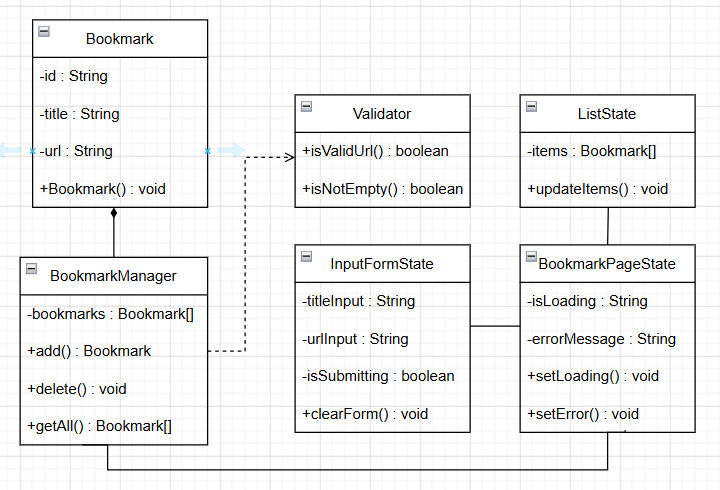
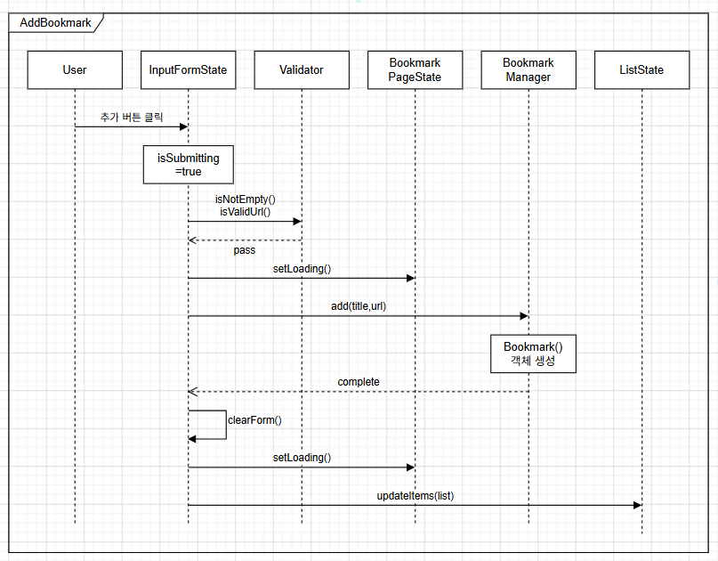
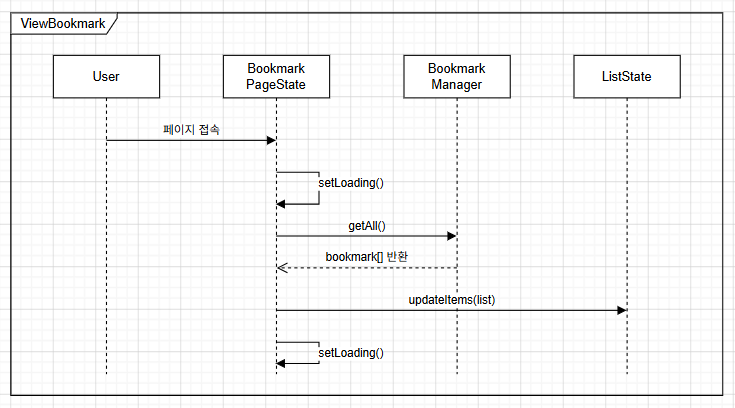
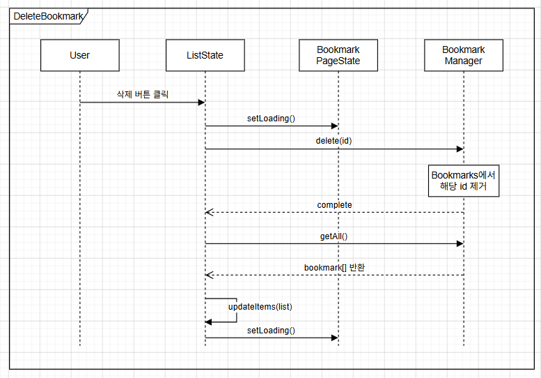
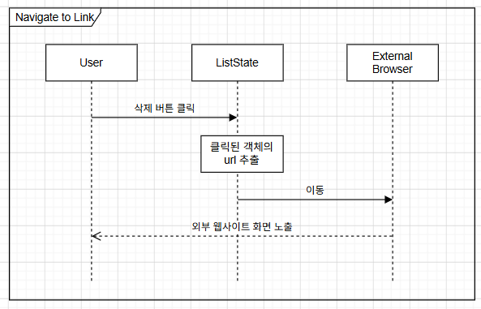
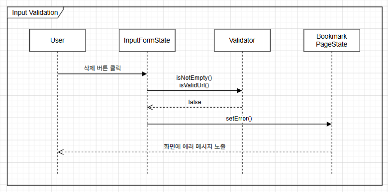
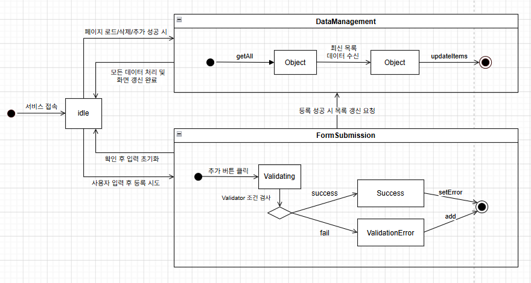

# Bookmark Archive
##### 22412053 이화윤 (lhydgdm@gmail.com)
 

## 1. Introduction

현대 사회에서는 인터넷의 사용이 일상화되면서 다양한 웹사이트와 온라인 자료를 자주 활용하게 된다. 학습 자료, 뉴스 기사, 영상 콘텐츠 등 수많은 정보가 웹상에 존재하지만, 필요한 정보를 다시 찾기 위해서는 사용자가 직접 주소를 기억하거나 검색해야하는 불편함이 있다. 이러한 문제를 해결하고자 개발하게 된 것이 바로 'BookMark Archive'이다. 사용자는 이 웹 서비스를 통해 다시 확인하고자 하는 자료를 손쉽게 저장하고 관리할 수 있으며, 필요할 때 빠르게 다시 접근할 수 있다. 불필요하고 조잡한 긴으을 최소화하고 필요한 핵심 기능에 집중하여, 사용자가 복잡한 과정 없이 직관적으로 북마크를 관리할 수 있도록 할 것이다. 북마크 추가, 조회, 삭제와 같은 핵심 기능과 저장된 링크를 타고 원하는 웹페이지로 이동할 수 있는 기능을 사용자에게 제공함으로써, 필요한 정보를 보다 쉽고 빠르게 관리하고 다시 접근할 수 있도록 할 것이다. 
이번 Design 보고서에서는 웹서비스를 구현하기 전에 시스템의 구조와 동작 과정을 구체적으로 설계하고자 한다. 이를 위해 Class Diagram을 통해 시스템의 구성 요소와 객체 간의 관계를 정의하고, Sequence Diagram을 통해 기능 수행 과정에서의 흐름과 객체 간 상호작용을 표현할 것이다. 또한 StateMachine Diagram을 활용하여 사용자 및 시스템 상태의 변화 과정을 분석함으로써 보다 효율적이고 안정적인 북마크 관리 웹서비스를 설계하고자 한다.  

----
## 2. Class Diagram

  
**1) Bookmark**  
(1) Attributes  
-id : 각 북마크를 식별하는 고유 키  
-title : 사용자가 지정한 웹사이트의 이름  
-url : 북마크가 가리키는 실제 웹 주소  
(2) Methoods  
+Bookmark() : 새로운 북마크 생성 및 초기화
  
**2) Validator**  
(1) Methoods  
+isValidUrl() : 입력된 값이 올바른 URL인지 확인  
+isNotEmpty() : 코멘트나 URL의 입력란이 비어있는지 확인   
**3) BookmarkManager**  
(1) Attributes  
-bookmarks : 생성된 북마크 객체들의 집합  
(2) Methoods  
+add(title, url) : 객체를 bookmarks에 추가  
+delete(id) : bookmarks에서 해당 북마크 삭제  
+getAll() : 현재 저장된 북마크 배열을 반환   
**4) BookmarkPageState**  
(1)Attributes  
-isLoading : 현재 데이터를 처리중인 상태인지 확인  
-errormessage : 유효성 검사에서 발생한 에러 텍스트를 저장  
(2) Methoods  
+setLoading() : 전체 화면의 로딩 상태를 스위치  
+setError() : 화면에 노출할 에러 메시지를 기록   
**5) InputFormState**  
(1) Attributes  
-titleInput : 현재 코멘트 입력창에 적힌 값  
-urlInput : 현재 URL 입력창에 적힌 값  
-isSubmitting : 저장 버튼을 누른 직후 버튼을 비활성화 시킴(중복 등록을 방지)
(2) Methoods  
+clearForm() : 북마크 등록 성공 후 입력칸을 비워줌   
**6) ListState**  
(1) Attribures  
-items : 현재 리스트 화면에 출력되고 있는 북마크 배열  
(2) Methoods  
+updateItems(list) : 새 리스트를 받아와 화면에 보여줄 데이터를 갱신   

----
## 3. Sequence Diagram

새 북마크를 추가하는 과정이다. 사용자가 추가 버튼을 누르면 중복 등록을 막기 위해 InputFormState의 버튼 비활성 상태가 먼저 세팅된다. 그리고 입력된 값들이 비어있지 않은지, 올바른 URL 형식인지 Validator를 통해 검증을 거친다. 검증이 통과되면 Bookmark가 add를 실행하여 객체를 생성한 후 배열에 저장한다.
저장이 완료되면 입력 창을 비우고, 추가된 데이터를 리스트 화면에 나타내기 위해 ListState에 북마크 배열을 불러온다.
  

북마크 리스트를 조회하는 과정이다. 사용자가 페이지에 진입하면 BookmarkManager에게 getAll을 호출하여 저장된 북마크 배열을 요청한다. 요청한 데이터를 전달받으면 ListState가 내부 item 속성을 갱신하며, 화면에 리스트 형태로 렌더링한다.
  

저장된 북마크를 삭제하는 과정이다. ListState에서 사용자가 특정 아이템의 삭제 버튼을 클릭하면, BookmarkManager에게 delete를 호출해 북마크 배열에서 해당 아이디의 데이터를 영구적으로 삭제한다. 삭제가 끝나면 화면을 최신 상태로 동기화하기 위해 다시 getAll로 최신 배열을 받아온 후, updateItems를 수행하여 화면에서 삭제된 요소를 지운다.
  

저장된 북마크를 클릭했을 때, 우리 시스템에서 벗어나 해당 웹 주소의 외부 사이트로 이동시키는 과정이다. 사용자가 북마크 리스트에서 특정 북마크의 URL을 클릭하면, ListState가 해당 객체가 보유하고 있는 URL 속성 값을 추출한다. 이후 외부 웹사이트 서버에 화면을 요청하고, 사용자는 새 창에서 해당 사이트를 보게 된다.
  

입력값의 유효성을 검증하는 과정이다. 사용자가 실수로 URL란을 비워두거나 잘못된 형식의 URL을 입력했을 때 추가 버튼이 눌리면, isEmpty나 isValidUrl 검증 메소드가 실행되어 잘못된 입력값임을 감지하고 false를 리턴한다. InputFormState는 setError를 호출하여 현재 에러 상황을 기록하고 errormessage 속성에 "올바른 URL 형식이 아닙니다"와 같은 텍스트를 저장한다. 이 에러 텍스트가 사용자의 화면에 노출되어 사용자가 올바른 형식으로 다시 입력할 수 있도록 유도한다.
  

----
## 4. State Machine Diageam

유저가 서비스를 시작하고 조회를 시도하면 시스템은 저장된 북마크 데이터를 싹 찾아오고, 데이터 수신이 완료되면 화면에 북마크 리스트를 띄워주며 기본 대기 상태인 메인 화면으로 참가한다.

메인 화면에서는 사용자가 새 북마크를 등록할지, 기존 리스트에서 특정 북마크를 클릭해 링크로 이동하거나 삭제할지 선택하게 된다. 해당 화면에서 새 북마크를 등록하고자 한다면 사용자는 이름과 실제 웹 주소를 입력창에 적고 등록 버튼을 누른다. 버튼을 누른 직후에는 시스템이 데이터를 처리하는 동안 사용자가 버튼을 실수로 또 누르지 못하도록 등록 버튼이 즉시 비활성화된다.

이후 시스템은 데이터 오작동을 막기 위해 입력란이 비어있는지 확인하고, 올바른 주소 형식인지를 검증하는 유효성 검사 단계로 진입한다. 검사 결과 입력 값이 잘못되었다면 검증 실패 상태로 빠지게 되며, 화면에 에러 메시지를 노출하고 유저가 주소를 다시 수정할 수 있도록 잠겼던 등록 버튼을 다시 활성화해 준다.

만약 유효성 검사를 무사히 통과한다면 본격적인 데이터 처리 단계로 이동하게 된다. 화면은 전체 로딩 상태로 전환되며, 시스템은 새로운 북마크 데이터를 생성하여 전체 북마크 저장소에 안전하게 집어넣는다. 추가 작업이 모두 완료되면 성공 응답을 보내고, 화면은 다음 입력을 편리하게 할 수 있도록 기존에 적혀있던 입력칸을 깨끗하게 비워준다.

마지막으로 데이터가 성공적으로 추가되었거나, 혹은 사용자가 기존 리스트에서 특정 북마크의 '삭제' 버튼을 눌렀을 때, 변경된 결과를 화면에 실시간으로 반영하기 위해 시스템은 다시 최신 리스트를 불러온다. 최신 데이터를 바탕으로 화면의 북마크 리스트를 갱신하고, 모든 그림이 새로 그려지면 다시 사용자의 명령을 기다리는 안전한 대기 상태로 돌아온다.

----
## 5. Implementation requirements

Runtime Environment: Google Chrome 또는 최신 웹 브라우저 환경 

Implement Language: JavaScript, HTML5, CSS3

----
## 6. Glossary

**Sequence Diagram** : 시스템을 구성하는 객체들의 속성과 메서드, 그리**고 객체들 간의 관계를 표현하는 정적인 다이어그램

**StateMachine Diagram** : 하나의 객체나 시스템이 가질 수 있는 모든 상태와, 사용자의 이벤트에 의해 그 상태가 어떻게 전환되는지 표현하는 동적인 다이어그램

----
## 7. References